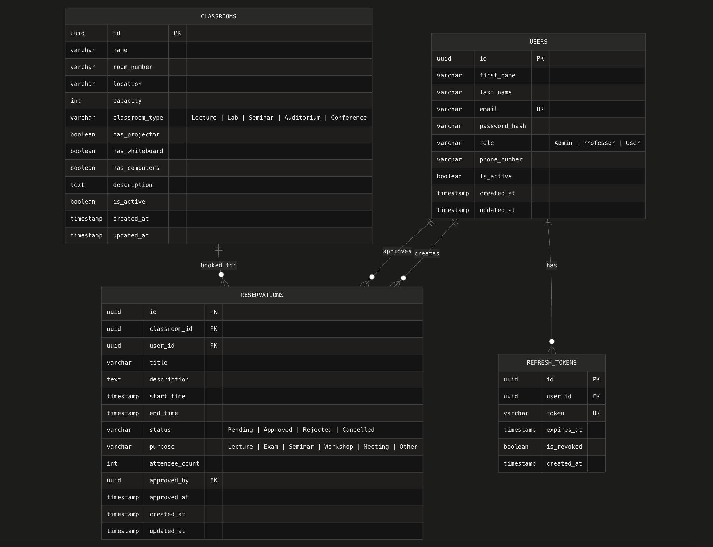

# Classroom Reservation Backend

A robust backend system for managing classroom reservations, built with ASP.NET Core and PostgreSQL.

## Features

- **User Management**: Authentication and role-based access control (Admin, Professor, User).
- **Classroom Management**: Detailed tracking of classrooms, including capacity, equipment (projectors, whiteboards, computers), and types.
- **Reservation System**: Seamless booking process with approval workflows.
- **Refresh Tokens**: Secure session management.

## Database Schema

The following ER diagram illustrates the database structure:



### Key Entities

- **Users**: Stores user information, roles, and status.
- **Classrooms**: Contains details about available rooms and their features.
- **Reservations**: Tracks bookings, linked to both users and classrooms, including status and purpose.
- **Refresh Tokens**: Managed tokens for persistent user sessions.

## Tech Stack

- **Framework**: ASP.NET Core 10
- **Database**: PostgreSQL
- **ORM**: Entity Framework Core
- **API Documentation**: OpenAPI (Swagger)

## Getting Started

### Prerequisites

- .NET 10 SDK
- PostgreSQL

### Setup

1. Clone the repository.
2. Update the connection string in `appsettings.json`.
3. Run migrations:
   ```bash
   dotnet ef database update
   ```
4. Run the application:
   ```bash
   dotnet run
   ```
